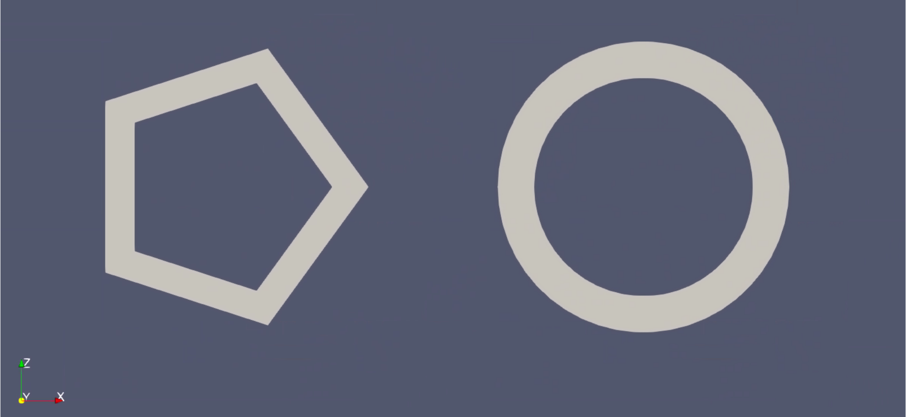
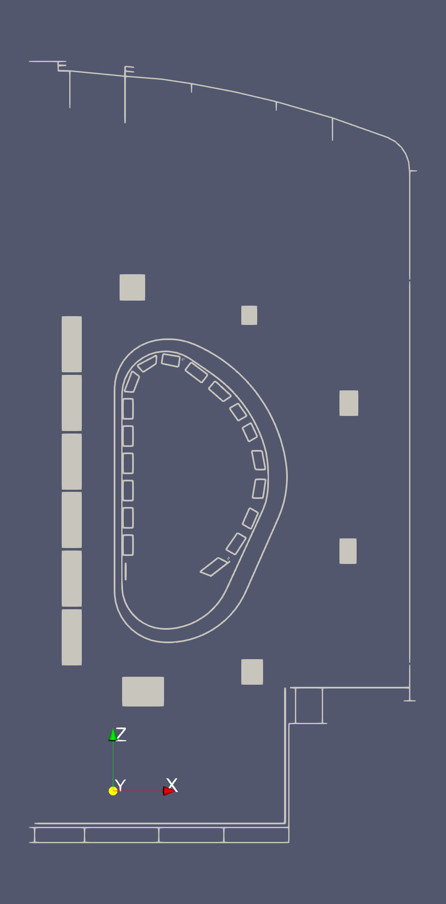

.. _`using the Geometry Reader (Axisymmetric)`:

Geometry Reader (Axisymmetric)
==============================

This page explains how to use the Geometry Reader (Axisymmetric) to visualize the axisymmetric active poloidal 
field coils, as well as axisymmetric passive conductor structures.

Supported IDSs
--------------

The following IDS and structures are supported in the Geometry Reader (Axisymmetric):

.. list-table::
   :widths: auto
   :header-rows: 1

   * - IDS
     - Structure
   * - ``pf_active``
     - `coil geometries <https://imas-data-dictionary.readthedocs.io/en/latest/generated/ids/pf_active.html#pf_active-coil-element-geometry>`__
   * - ``pf_passive``
     - `loop geometries <https://imas-data-dictionary.readthedocs.io/en/latest/generated/ids/pf_passive.html#pf_passive-loop-element-geometry>`__
   * - ``ferritic``
     - `axisymmetric geometries <https://imas-data-dictionary.readthedocs.io/en/latest/generated/ids/ferritic.html#ferritic-object-axisymmetric>`__
   * - ``ic_antennas``
     - `strap geometries <https://imas-data-dictionary.readthedocs.io/en/latest/generated/ids/ic_antennas.html#ic_antennas-antenna-module-strap-geometry>`__
   * - ``iron_core``
     - `segment geometries <https://imas-data-dictionary.readthedocs.io/en/latest/generated/ids/iron_core.html#iron_core-segment-geometry>`__

Using the Geometry Reader (Axisymmetric)
----------------------------------------

The Geometry Reader (Axisymmetric) functions similarly to the GGD Reader, 
with the same interface and data loading workflow. 
This means that the steps for loading an URI, an IDS, and selecting attributes are identical. 
Refer to the :ref:`using the GGD Reader` for detailed instructions on:

- :ref:`Loading an URI <loading-an-uri>`: How to provide the file path or select a dataset.
- :ref:`Loading an IDS <loading-an-ids>`: How to load a dataset and display the grid.
- :ref:`Selecting attribute arrays <selecting-ggd-arrays>`: How to choose and visualize attributes.

Setting the Geometry Resolution
-------------------------------

The Geometry Reader (Axisymmetric) allows you to change the resolution parameter that 
controls how many points are used to render the ``arcs_of_circle`` and ``annulus`` geometries.

   ``annulus`` geometry element with a resolution of 5 (left) and a resolution of 50 (right)

Example Case
------------

The following figure uses the Geometry Reader (Axisymmetric) to visualize the 
geometries of the ``pf_active`` and ``pf_passive`` IDSs of the following machine description URIs:

- ``imas:hdf5?path=/work/imas/shared/imasdb/ITER_MD/3/111001/204``
- ``imas:hdf5?path=/work/imas/shared/imasdb/ITER_MD/3/115004/6``
- ``imas:hdf5?path=/work/imas/shared/imasdb/ITER_MD/3/116001/3``
- ``imas:hdf5?path=/work/imas/shared/imasdb/ITER_MD/3/124001/3``

