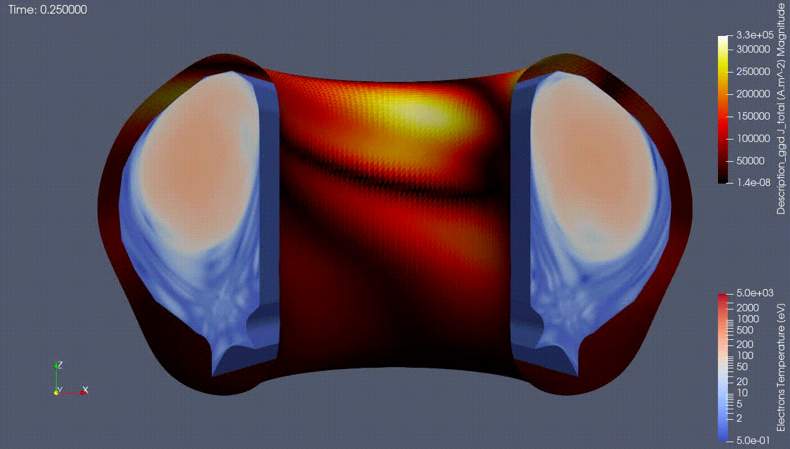

.. _`gallery`:

=======
Gallery
=======

JOREK Animation
---------------

   Animation of the electron temperature and wall currents in a JOREK simulation. 
   A step-by-step tutorial on how to re-create this animation using the IMAS-ParaView 
   tools has been provided in the :ref:`tutorial <training_jorek>`.

   Data provided by J. Artola, using the following URI:

   .. code-block::

      imas:hdf5?user=public;pulse=112111;run=2;database=ITER_DISRUPTIONS;version=4

Contributing to the Gallery
---------------------------

Have a cool visualisation made with IMAS-ParaView? We'd love to feature it here!
Contributions are welcome via a pull request on the
`IMAS-ParaView GitHub repository <https://github.com/iterorganization/IMAS-ParaView>`_.

Please follow the steps below to contribute:

#. Create a `fork <https://github.com/iterorganization/IMAS-ParaView/fork>`_ of the IMAS-ParaView repository.
#. Add your image or animation to the ``docs/source/images/gallery/`` directory.
#. Edit ``docs/source/gallery.rst`` and add a ``.. figure::`` entry with a short description of the image.
   Ensure you have permission to use the image and properly credit the data owners.
#. Open a pull request from your fork back to the main repository on the ``develop`` branch. 
   A maintainer will review and merge it.
