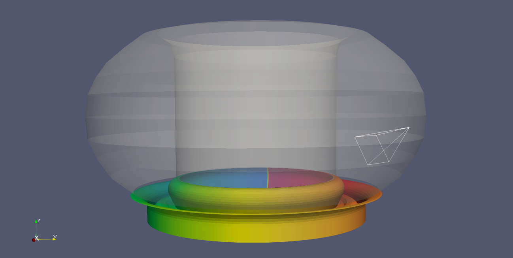
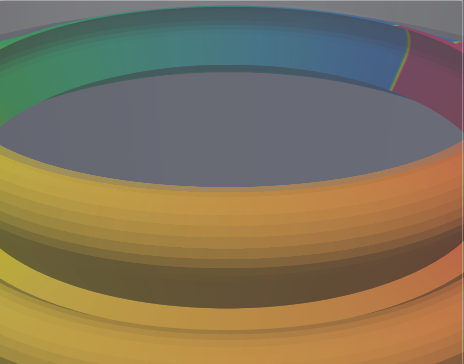

.. _`using the Camera Reader`:

Camera Reader
=============

This page explains how to use the Camera Reader to visualize camera optical geometries
different IDSs containing camera data.

.. note::
   The Camera Reader does not visualize any image data recorded by the camera.

Supported IDSs
--------------

Currently, the following IDS and structures are supported in the Camera Reader:

.. list-table::
   :widths: auto
   :header-rows: 1

   * - IDS
     - Structure
   * - ``camera_ir``
     - `Camera channels <https://imas-data-dictionary.readthedocs.io/en/latest/generated/ids/camera_ir.html#camera_ir-channel>`__
   * - ``camera_visible``
     - `Camera channels <https://imas-data-dictionary.readthedocs.io/en/latest/generated/ids/camera_visible.html#camera_visible-channel>`__

Using the Camera Reader
-----------------------

The Camera Reader functions similarly to the GGD Reader, with the same interface and
data loading workflow.
This means that the steps for loading an URI, an IDS, and selecting attributes are
identical.
Refer to the :ref:`using the GGD Reader` for detailed instructions on:

- :ref:`Loading an URI <loading-an-uri>`: How to provide the file path or select a dataset.
- :ref:`Loading an IDS <loading-an-ids>`: How to load a dataset and display the grid.
- :ref:`Selecting attribute arrays <selecting-ggd-arrays>`: How to choose which cameras
  to visualize.

Snapping the View to a Camera
------------------------------

The **Snap View to Camera** widget lets you align the active ParaView RenderView with
any loaded camera so that the viewport matches the camera's optical position and
field of view.

To snap the view:

1. Load and apply the Camera Reader with at least one camera selected.
2. In the **Snap View to Camera** section of the Properties panel, choose the desired
   camera from the **Select Camera** drop-down menu.
3. Select **Apply** to confirm the selection.
4. Press the **Snap View to Camera** button.

The ParaView camera will immediately move to the position and orientation of the
selected IDS camera.

.. note::

  The Camera Reader cannot change the active RenderView’s aspect ratio and will use 
  either the horizontal or vertical field of view, based on the current viewport size. 
  The remaining axis will not match and must be adjusted manually to align with the 
  camera’s view, the camera view can be used as a guide for this.

Example Case
------------

The following figure shows the Camera Reader applied to an ``camera_visible`` IDS,
showing a single camera pointing at the divertor. The following URI was used for this
example:

.. code-block:: 

  imas:hdf5?path=/work/imas/shared/imasdb/ITER_MACHINE_DESCRIPTION/3/150701/1002

  Wireframe of the camera view, along with the first wall and divertor structures
  visualized using the Wall Limiter Reader in white and rainbow colors, respectively.

   ParaView's RenderView when snapping to the camera above.
