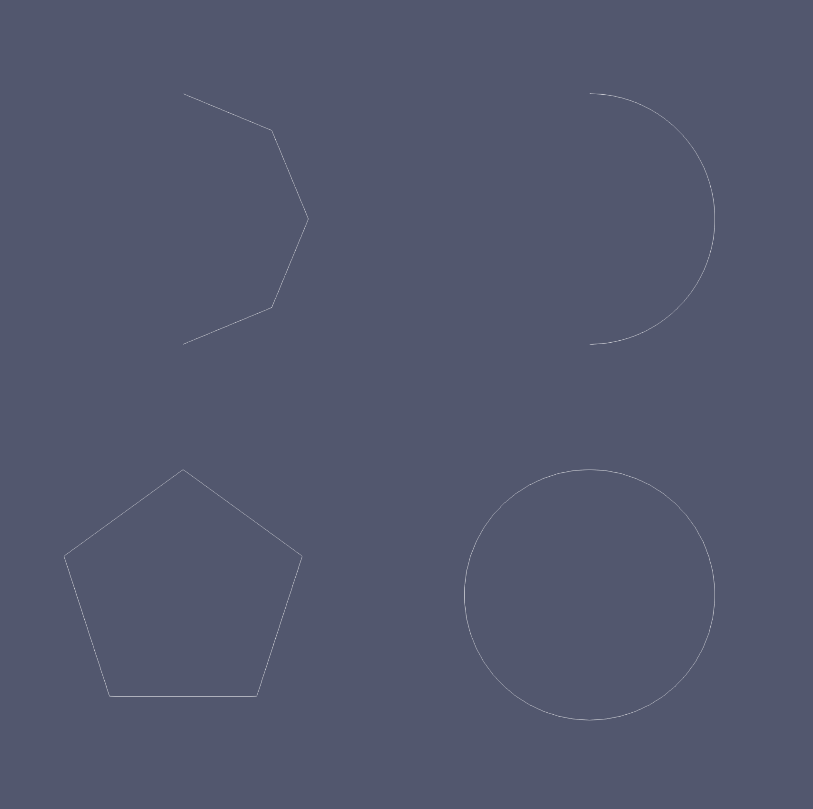
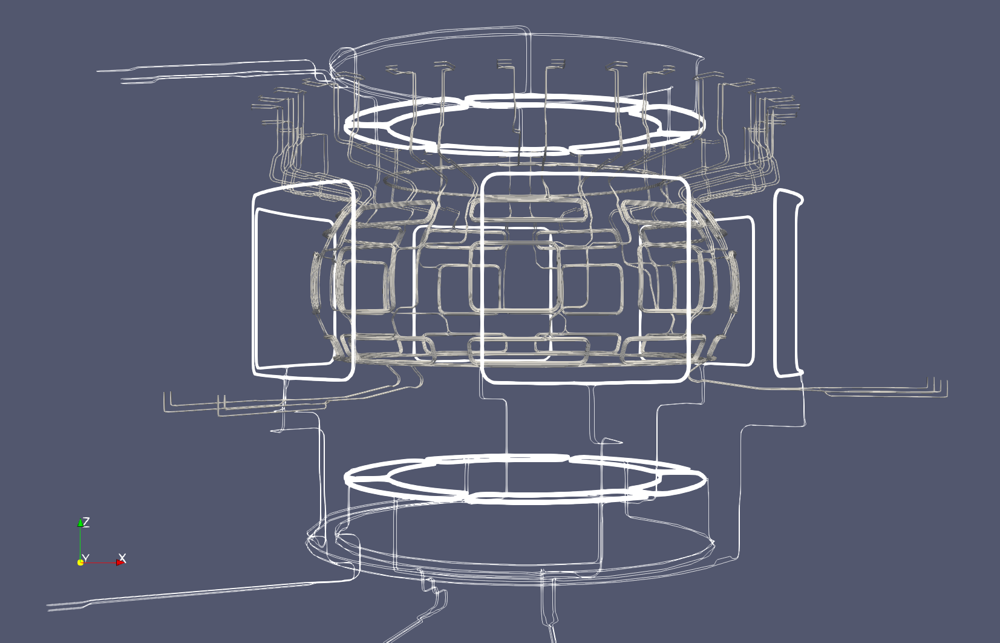

.. _`using the Non-Axisymmetric Coils Reader`:

Non-Axisymmetric Coils Reader
=============================

.. versionadded:: 2.3.0

This page explains how to use the Non-Axisymmetric Coils Reader to visualize the 
Non-axisymmetric active coil systems.

Supported IDSs
--------------

The following IDSs and structures are supported in the Non-Axisymmetric Coils Reader:

.. list-table::
   :widths: auto
   :header-rows: 1

   * - IDS
     - Structure
   * - ``coils_non_axisymmetric``
     - `conductor <https://imas-data-dictionary.readthedocs.io/en/latest/generated/ids/coils_non_axisymmetric.html#coils_non_axisymmetric-coil-conductor>`__
   * - ``tf``
     - `conductor <https://imas-data-dictionary.readthedocs.io/en/latest/generated/ids/tf.html#tf-coil-conductor>`__

Supported Cross-Sections
-------------------------

For each conductor element, a cross-sectional geometry can optionally be provided in
`cross_section <https://imas-data-dictionary.readthedocs.io/en/latest/generated/ids/coils_non_axisymmetric.html#coils_non_axisymmetric-coil-conductor-cross_section>`__.
Its shape is defined by ``geometry_type``, an
`identifier <https://imas-data-dictionary.readthedocs.io/en/latest/generated/identifier/surface_geometry_identifier.html>`__
with the following supported values:

.. list-table::
   :widths: auto
   :header-rows: 1

   * - Name
     - Index
     - Description
   * - ``polygon``
     - 1
     - Polygonal cross-section, described by ``outline``, a set of 2D points in the
       local (normal, binormal) coordinate system of the conductor centreline. This
       is used to represent, e.g., rectangular conductors.
   * - ``circle``
     - 2
     - Circular cross-section, with a diameter given by ``width``.
   * - ``annulus``
     - 5
     - Annular cross-section, with an outer diameter given by ``width`` and an inner
       radius given by ``radius_inner``.

.. versionadded:: 2.5.0
   Support for polygon cross-sections (``geometry_type`` index 1).

Any other cross-section type is not supported and the conductor centreline is shown
instead, without any cross-section.

For polygon cross-sections, the outline is swept along the conductor centreline
using the (normal, binormal) orientation frame of each element:

- For ``arc_of_circle`` and ``full_circle`` elements, this frame follows directly
  from the geometry description (the normal points from the curve towards the
  centre of the circle).
- For ``line_segment`` elements, the frame is derived from the ``intermediate_points``
  of the element, as prescribed by the Data Dictionary. Some machine description
  data does not fill in ``intermediate_points`` for line segments, since it is only
  used to fix the cross-section orientation. In that case, the orientation of the
  previous conductor element is instead carried over (or picked arbitrarily for
  the first element of a conductor), to keep the cross-section continuous along the
  conductor.

Using the Non-Axisymmetric Coils Reader
---------------------------------------

The Non-Axisymmetric Coils Reader functions similarly to the GGD Reader, with the same interface and data loading workflow. 
This means that the steps for loading an URI, an IDS, and selecting attributes are identical. 
Refer to the :ref:`using the GGD Reader` for detailed instructions on:

- :ref:`Loading an URI <loading-an-uri>`: How to provide the file path or select a dataset.
- :ref:`Loading an IDS <loading-an-ids>`: How to load a dataset and display the grid.
- :ref:`Selecting attribute arrays <selecting-ggd-arrays>`: How to choose and visualize attributes.

Setting the Geometry Resolution
-------------------------------

The Non-Axisymmetric Coils Reader allows you to change two resolution parameters that 
control how coil geometry is discretized for visualization.

Resolution
^^^^^^^^^^

Defines the number of interpolation points used to represent curved conductor elements (arc_of_circle and full circle). 
Increasing this value produces smoother coil elements at the cost of higher geometric complexity.

   Arc of circle element (top) and a full circle element (bottom) with a resolution of 5 (left) and 50 (right)

Cross-sectional Resolution
^^^^^^^^^^^^^^^^^^^^^^^^^^

Defines the number of interpolation points used to approximate the conductor cross-section when a 
circular or annulus cross-sectional geometry is present. Increasing this value produces a smoother, 
more circular cross-section. This setting has no effect on polygon cross-sections, since these are
represented exactly by their ``outline``.

Example Case
------------

The following figure uses the Non-Axisymmetric Coils Reader to visualize the 
geometries of the ``coils_non_axisymmetric`` IDSs of the following machine description URIs:

- ``imas:hdf5?path=/work/imas/shared/imasdb/ITER_MD/3/111003/2``
- ``imas:hdf5?path=/work/imas/shared/imasdb/ITER_MD/3/115001/2``
- ``imas:hdf5?path=/work/imas/shared/imasdb/ITER_MD/3/115002/2``
- ``imas:hdf5?path=/work/imas/shared/imasdb/ITER_MD/3/115003/2``

