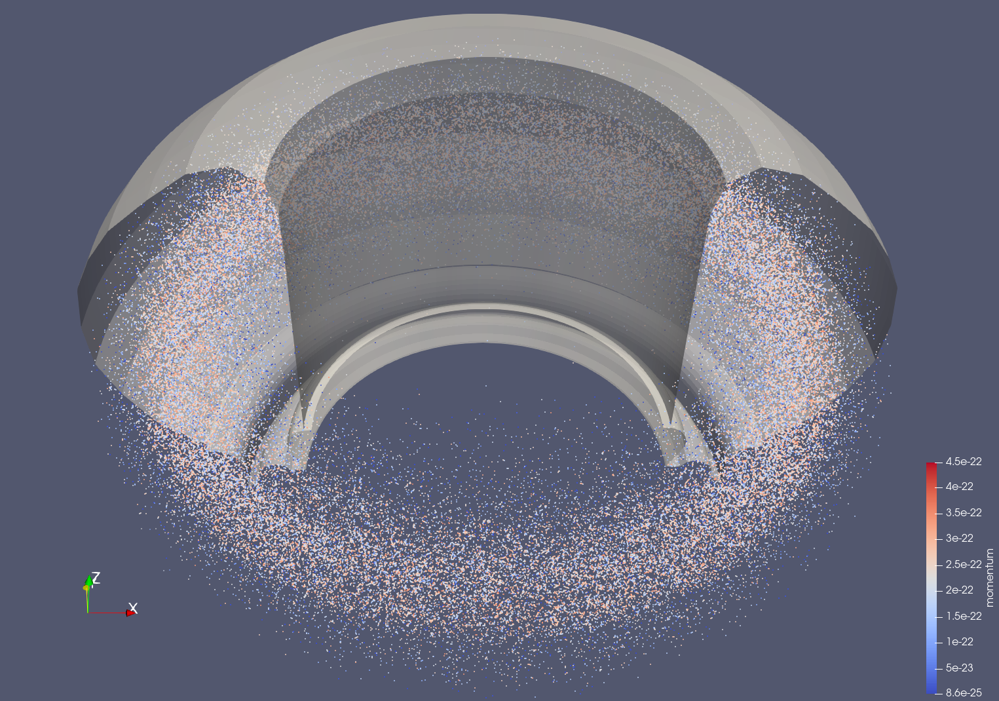
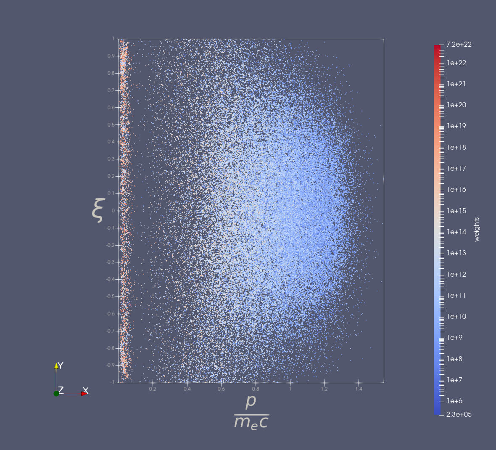

.. _`using the Distributions Reader`:

Distributions Reader
====================

.. versionadded:: 2.4.0

This page explains how to use the Distributions Reader. This reader can 
visualize the set of time-dependent markers (test particles) of a distributions IDS.

Supported IDSs
--------------

Currently, the following IDS and structures are supported in the Distributions
Markers Reader:

.. list-table::
   :widths: auto
   :header-rows: 1

   * - IDS
     - Structure
   * - ``distributions``
     - `Markers <https://imas-data-dictionary.readthedocs.io/en/latest/generated/ids/distributions.html#distributions-distribution-marker>`__

Using the Distributions Reader
------------------------------

The Distributions Reader functions similarly to the GGD Reader, with the
same interface and data loading workflow.
This means that the steps for loading an URI, an IDS, and selecting attributes are
identical.
Refer to the :ref:`using the GGD Reader` for detailed instructions on:

- :ref:`Loading an URI <loading-an-uri>`: How to provide the file path or select a dataset.
- :ref:`Loading an IDS <loading-an-ids>`: How to load a dataset and display the grid.
- :ref:`Selecting attribute arrays <selecting-ggd-arrays>`: How to choose and visualize attributes.

Plugin Settings
---------------

The Distributions Reader allows you to load the coordinates available the in 
distribution, marked by the `coordinate_identifiers <https://imas-data-dictionary.readthedocs.io/en/latest/generated/ids/distributions.html#distributions-distribution-markers>`_. 

By default, the reader will try to use ``x``, ``y``, and ``z`` coordinates in Paraview, 
if they are available in the distribution's coordinate identifiers. It is also possible 
to map other coordinates in the distribution onto the ParaView axes using the 
dropdown menus under the **Axis Coordinate Mapping** settings. Optionally, a scaling 
factor can be applied for each axis.

.. note:: 

   This reader assumes that the coordinate_identifiers of a distribution stays the same
   over time.

Examples
^^^^^^^^

The following examples use the distributions IDS from this URI, provided by J. Artola.

.. code-block:: text

  imas:hdf5?user=artolaj;pulse=111111;run=1;database=markers;version=4

   Positions of markers of the electron distribution, colored by momentum. The 
   divertor and first wall from the ITER machine description are shown in translucent white.

The next example shows the marker particles in momentum space.

   Positions of markers of electron distribution in momentum space, colored by marker weight. 
   The ``momentum`` coordinate was mapped onto the X-axis and scaled by :math:`\frac{1}{m_e c}`, 
   where :math:`m_e` is the electron mass, and :math:`c` the speed of light. The ``pitch``
   coordinate was mapped onto the Y-axis.

