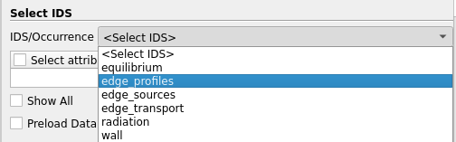
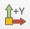
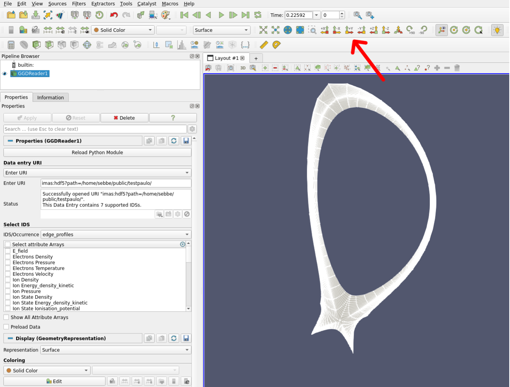
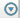
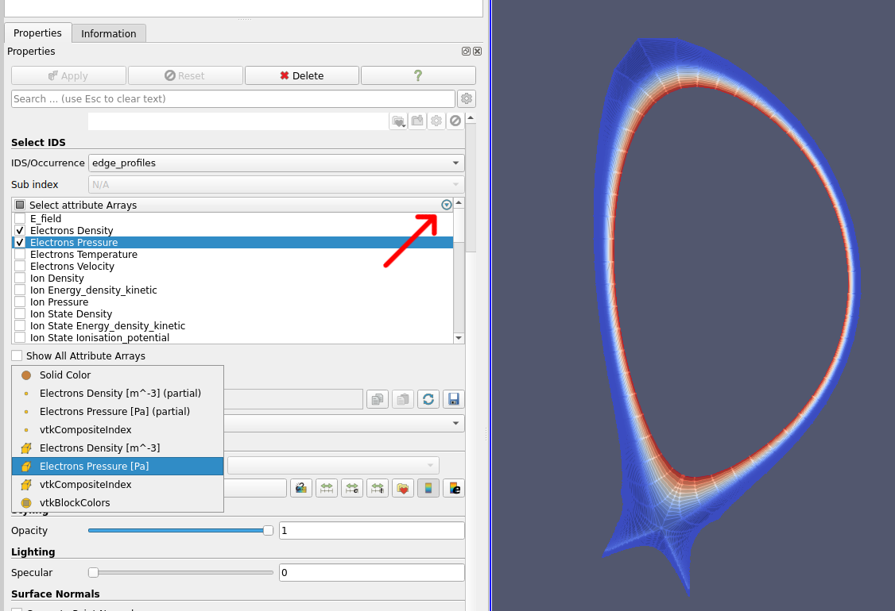
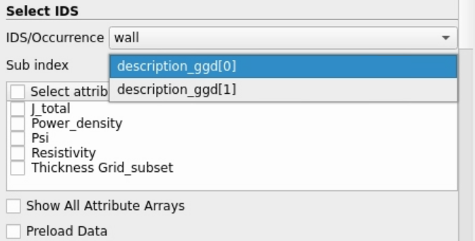

.. _`using the GGD Reader`:

GGD Reader
==========

.. versionchanged:: 2.4.0 Added cylindrical to Cartesian coordinate conversion
.. versionchanged:: 2.2.0 Added support for heterogeneous time mode.

This page will go over how to use the GGD Paraview plugin.

.. tip:: More information about the usage of specific plugin UI elements can be obtained by hovering
   the mouse over the element.

Supported IDSs
--------------

Currently, the following IDSs are supported in the GGD Reader.

- ``edge_profiles``
- ``edge_sources``
- ``edge_transport``
- ``mhd``
- ``radiation``
- ``runaway_electrons``
- ``wall``
- ``equilibrium``
- ``distribution_sources``
- ``distributions``
- ``tf``
- ``transport_solver_numerics``
- ``waves``
- ``plasma_profiles``,
- ``plasma_sources``,
- ``plasma_transport``,

.. _loading-an-uri:

Loading an URI
--------------
If Paraview is correctly installed according to the :ref:`installation docs <installing>`, you should
see the GGD reader plugin under `Sources > IMAS Tools > GGD Reader`. Selecting this source
will create a GGD Reader source in the Paraview pipeline.

The first step is to select which URI you want to load. The GGD Reader provides three different
methods of supplying an URI.

1. A string containing the URI.
2. A file browser with which you can select the file to load.
3. Manual selection of the backend, database, pulse, run, user, and version.

The different input options are shown in the figure below:

.. list-table::
   :widths: 33 33 33
   :header-rows: 0

   * - .. figure:: ../images/input_uri.png

         1\. String input.
     - .. figure:: ../images/input_file.png

         2\. File browser.
     - .. figure:: ../images/input_legacy.png

         3\. Manual input.

.. _loading-an-ids:

Loading an IDS
--------------
When the URI input is selected, and filled accordingly, you can press `Apply` to load the URI.
If the URI loads successfully, an IDS can be selected from the drop-down list. The reader automatically
detects which IDSs are available for the given URI, and only shows applicable IDSs for this plugin.

   The drop-down list to select an IDS.

When the desired IDS is selected, click on `Apply` to load it. After the IDS is loaded, 
the grid should appear in the viewport. If the grid does not show up, it is
possible that the axes are not aligned properly. You can use the buttons above to align your viewpoint
with the data. For example, to align the viewpoint in the positive Y direction, press: |ico1|.

You should now be able to see the mesh of the GGD.

   The mesh of the GGD.

.. _selecting-ggd-arrays:

Selecting GGD arrays
--------------------
Attributes which are defined on the GGD grid can be loaded using the Attribute Selection window. 
The selection window can be found on the left under `Select attribute Arrays`.
Any number of attributes can be selected, and the list
can be filtered using the |ico2|-icon in the top right of the selection window. 
When the attributes are selected, click on `Apply` to load the selected attributes from the backend.
The selected quantities can now be visualized using Paraview's selection drop-down menu.

   Visualize the `Electron Pressure` of the GGD.

.. note:: By default, the data is lazy loaded. This means that the data will only be fetched from
   the backend as soon it is required by the plugin. This helps loading times, as we don't need to
   fetch the entire dataset before handling any data. If you plan on loading the entire dataset, it
   may be beneficial to load all data up front. This can be done by enabling the `Preload Data`
   checkbox in the plugin settings.

Sub index
---------

You may have noticed the greyed-out dropdown labeled "Sub index" in the previous
sections. This dropdown allows you to select different parent structures that may
contain a GGD grid, but only applies to some IDSs.

One of these IDSs is the ``wall`` IDS, where the GGD grids are defined inside the
``description_ggd`` array. You can use this dropdown to select which array element
should be visualized:

   Choose between visualizing the grid from ``description_ggd[0]`` or
   ``description_ggd[1]``. The meaning of the different indices is dependent on the data
   provider.

Converting Vector Components
----------------------------

By default, the plugin will load all the GGD vector components stored in the loaded data,
which may contain cylindrical components. It is possible to convert the cylindrical vector 
components to Cartesian coordinates, by enabling the **Convert cylindrical to Cartesian components** 
option in the plugin settings and clicking `Apply`. When enabled, the plugin will convert 
the ``r``, ``phi``, and ``z`` components into ``x``, ``y``, and ``z`` components.

.. warning::
   If you enable this checkbox and the vector components dropdown still shows cylindrical components,
   this is due to a `known ParaView bug <https://gitlab.kitware.com/paraview/paraview/-/work_items/23279>`_.
   You can force a UI refresh by temporarily changing the Coloring dropdown to 
   **Solid Color** and then switching back to your selected vector array.

   ..  image:: ../images/ggd_reader_vector_issue.png
