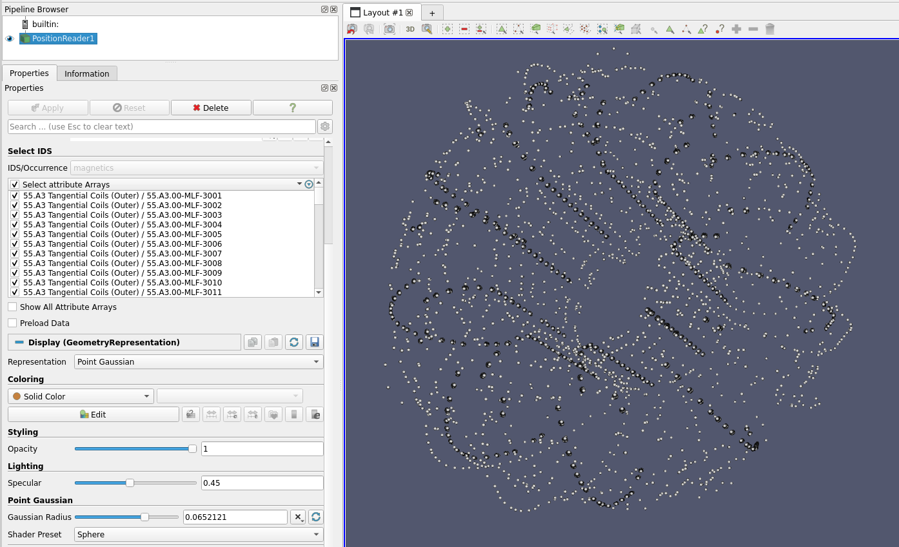

.. _`using the Magnetics Reader`:

Magnetics Reader
================

.. versionadded:: 2.4.0

This page explains how to use the Magnetics Reader to visualize magnetic diagnostic
geometries from the ``magnetics`` IDS.

Supported IDSs
--------------

The following structures are supported in the Magnetics Reader:

.. list-table::
   :widths: auto
   :header-rows: 1

   * - IDS
     - Structure
   * - ``magnetics``
     - `flux_loop <https://imas-data-dictionary.readthedocs.io/en/latest/generated/ids/magnetics.html#magnetics-flux_loop>`__
   * - ``magnetics``
     - `b_field_pol_probe <https://imas-data-dictionary.readthedocs.io/en/latest/generated/ids/magnetics.html#magnetics-b_field_pol_probe>`__
   * - ``magnetics``
     - `b_field_phi_probe <https://imas-data-dictionary.readthedocs.io/en/latest/generated/ids/magnetics.html#magnetics-b_field_phi_probe>`__
   * - ``magnetics``
     - `rogowski_coil <https://imas-data-dictionary.readthedocs.io/en/latest/generated/ids/magnetics.html#magnetics-rogowski_coil>`__

Using the Magnetics Reader
--------------------------

The Magnetics Reader functions similarly to the GGD Reader, with the same interface and data loading workflow.
This means that the steps for loading an URI, an IDS, and selecting attributes are identical.
Refer to the :ref:`using the GGD Reader` for detailed instructions on:

- :ref:`Loading an URI <loading-an-uri>`: How to provide the file path or select a dataset.
- :ref:`Loading an IDS <loading-an-ids>`: How to load a dataset and display the grid.
- :ref:`Selecting attribute arrays <selecting-ggd-arrays>`: How to choose and visualize attributes.

Visualized Elements
------------------

Flux Loops and Rogowski Coils
^^^^^^^^^^^^^^^^^^^^^^^^^^^^^

Flux loops and Rogowski coils are visualized as closed polylines representing the wire geometry.
Each element is displayed using the position coordinates defined in the IDS.

B-Field Probes
^^^^^^^^^^^^^^

Poloidal and toroidal B-field probes are visualized as arrows indicating the sensor orientation.
The arrow direction is determined by the poloidal and toroidal angles defined for each probe.

   Visualization of flux loops (green), Rogowski coils (blue), poloidal B-field probes (red),
   and toroidal B-field probes (yellow) from an example ``magnetics`` IDS.

Setting the Probe Arrow Length
------------------------------

The Probe Arrow Length parameter controls the length of the arrows drawn for each B-field probe
(in meters). The arrow tip is placed at the specified distance from the probe center along the
sensor normal axis.
