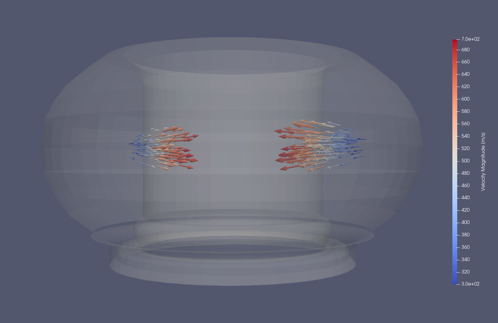

.. _`using the Pellets Reader`:

(Shattered) Pellets Reader
===========================

.. versionadded:: 2.4.0

This page explains how to use the (Shattered) Pellets Reader to visualize shattered
pellet injection (SPI) data.

Supported IDSs
--------------

Currently, the following IDS and structures are supported in the (Shattered) Pellets
Reader:

.. list-table::
   :widths: auto
   :header-rows: 1

   * - IDS
     - Structure
   * - ``spi``
     - `Injector fragments <https://imas-data-dictionary.readthedocs.io/en/latest/generated/ids/spi.html#spi-injector-fragment>`__

Using the (Shattered) Pellets Reader
--------------------------------------

The (Shattered) Pellets Reader functions similarly to the GGD Reader, with the same
interface and data loading workflow.
This means that the steps for loading an URI, an IDS, and selecting attributes are
identical.
Refer to the :ref:`using the GGD Reader` for detailed instructions on:

- :ref:`Loading an URI <loading-an-uri>`: How to provide the file path or select a dataset.
- :ref:`Loading an IDS <loading-an-ids>`: How to load a dataset and display the grid.
- :ref:`Selecting attribute arrays <selecting-ggd-arrays>`: How to choose and visualize attributes.

Plugin Settings
---------------

The (Shattered) Pellets Reader exposes scaling factors that allow you to adjust the 
visual size of the rendered geometry.

- ``Fragment Scaling Factor`` - Controls the size of the spheres used to represent shattered 
  pellet fragment positions. A value of ``1.0`` (the default) renders each sphere with 
  a radius equal to the derived fragment radius.
- ``Fragment Velocity Scaling Factor`` - Controls the length of the arrows used to represent 
  individual fragment velocities.
- ``Velocity Centre of Mass Scaling Factor`` -  Controls the length of the arrow that 
  represents the velocity of the centre of mass of all fragments at the shattering origin.

Example Case
------------

The following example shows the velocity vectors of a group of shattered pellet 
fragments originating from two different injectors.

