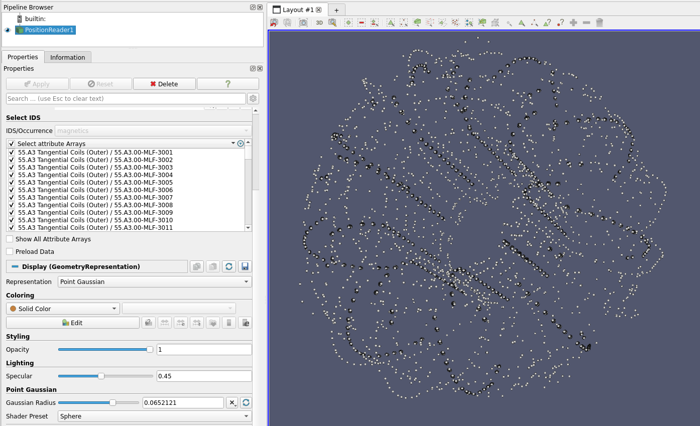

.. _`using the Position Reader`:

Position Reader
===============

This page explains how to use the Position Reader to visualize position IDS data structures.

Supported IDSs
--------------

Currently, the following IDSs are supported in the 1D Profiles Reader.

- ``barometry``
- ``langmuir_probes``
- ``magnetics``

Using the Position Reader
-------------------------

The Position Reader functions similarly to the GGD Reader, with the same interface and data loading workflow. 
This means that the steps for loading an URI, an IDS, and selecting attributes are identical. 
Refer to the :ref:`using the GGD Reader` for detailed instructions on:

- :ref:`Loading an URI <loading-an-uri>`: How to provide the file path or select a dataset.
- :ref:`Loading an IDS <loading-an-ids>`: How to load a dataset and display the grid.
- :ref:`Selecting attribute arrays <selecting-ggd-arrays>`: How to choose and visualize attributes.

Visualize the positions
-----------------------

To visualize the selected positions, under ``Representation`` select ``Point Gaussian``. 
The ``Gaussian Radius`` can be changed to a suitable size such that the points are 
clearly visible.

   Positions of sensors in a magnetics IDS.
