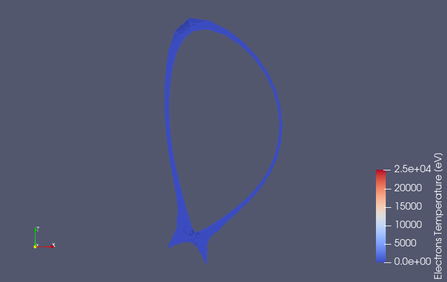
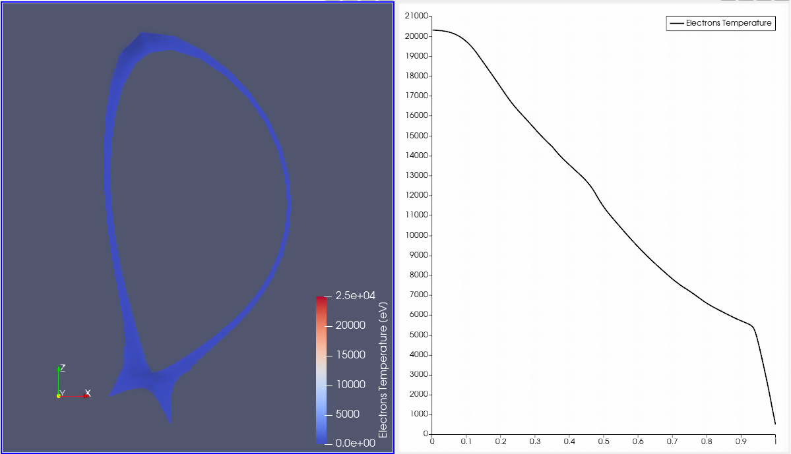
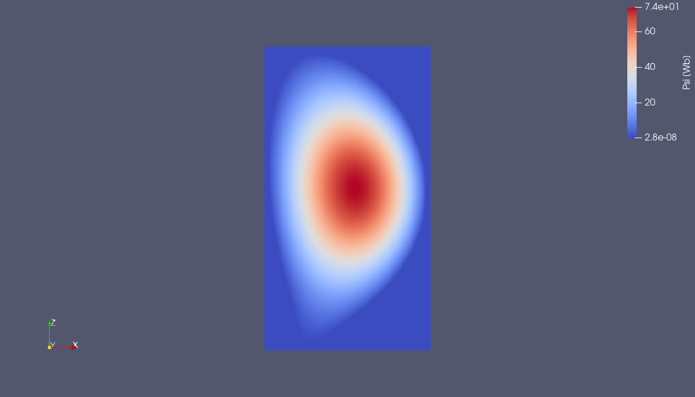
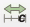
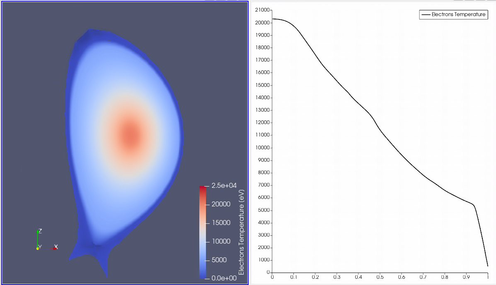

.. _`training_jintrac`:

JINTRAC case
------------
In this example, we will visualize the electron temperature GGD of the edge profiles IDS, as well as the 1D core profiles. We will use the psi grid from the equilibrium IDS to map the 1D electron temperature profiles onto a 2D grid. By doing this, we can visualize the electron temperature both in the edge plasma, as well as in the core in a single image.

It is recommended to go through the steps below by hand, however if you do not want to follow the steps, a ParaView state file containing this example is made available :download:`here <pv_states/jintrac_state.pvsm>`.

Loading the Edge Profiles Electron Temperature
^^^^^^^^^^^^^^^^^^^^^^^^^^^^^^^^^^^^^^^^^^^^^^
This subsection covers loading and visualizing the electron temperature in the edge plasma region from the edge_profiles IDS data.

.. |ico1| image:: images/rotate_axis.png

#. Navigate to *Sources > IMAS Tools* and select the GGD Reader.
#. Enter the following URI in the ``Enter URI`` field of the GGD reader plugin:

   .. code-block:: bash

      imas:hdf5?path=/work/imas/shared/TEST/simulations/test/8743dad6d7f211ef8fd59440c9e7706c/imasdb/iter/3/53298/2
#. Select the `edge_profiles` IDS in the IDS/Occurrence dropdown menu.
#. Select ``Apply`` to load the edge profiles GGD grid.
#. After the GGD grid is loaded, bring the grid into view by aligning the viewpoint in the positive Y direction using the following button: |ico1|.
#. Select the ``Electrons Temperature`` from the attribute array selection window.
#. Select ``Apply`` to load the electron temperature values on the grid.
#. Select ``Electrons Temperature [eV]`` in the coloring dropdown to visualize the electron temperature.

   GGD grid of the edge profiles containing the electron temperature. Data provided by S.H. Kim.

Loading the Electron Temperature 1d Profile
^^^^^^^^^^^^^^^^^^^^^^^^^^^^^^^^^^^^^^^^^^^
This subsection covers loading the 1D electron temperature profiles, and plotting it in a line chart with the normalized toroidal flux coordinate (``rho_tor_norm``) on the x-axis.

#. Navigate to *Sources > IMAS Tools* and select the 1D Profiles Reader.
#. Enter the following URI in the ``Enter URI`` field of the 1D Profiles reader plugin:

   .. code-block:: bash

      imas:hdf5?path=/work/imas/shared/TEST/simulations/test/8743dad6d7f211ef8fd59440c9e7706c/imasdb/iter/3/53298/2
#. Select the `core_profiles` IDS in the IDS/Occurrence dropdown menu.
#. Select ``Apply`` to load the available core profiles.
#. Select the ``Electrons Temperature`` from the attribute array selection window.
#. Select ``Apply`` to load the electron temperature 1D profile.
#. To plot the 1D profile, we will apply a plotting filter. This can be found under *Filters > Data Analysis > Plot Data*. Select ``Apply`` to apply filter.
#. In the filter properties, uncheck ``Use Index For X Axis`` and in the ``X Array Name`` dropdown select ``rho_tor_norm``. Also uncheck ``rho_tor_norm`` from the Series Parameters. You should now have a line chart of the electron temperature with the normalized toroidal flux coordinate on the x-axis.

   GGD grid of the edge profiles containing the electron temperature (left). 1D core profile of the electron temperature (right). Data provided by S.H. Kim.

Loading the Poloidal Flux 2D Profile
^^^^^^^^^^^^^^^^^^^^^^^^^^^^^^^^^^^^
This subsection covers loading and visualizing the poloidal flux from the equilibrium IDS to create the 2D plane for mapping 1D profiles.

#. Navigate to *Sources > IMAS Tools* and select the 2D Profiles Reader.
#. Enter the following URI in the ``Enter URI`` field of the 2D Profiles reader plugin:

   .. code-block:: bash

      imas:hdf5?path=/work/imas/shared/TEST/simulations/test/8743dad6d7f211ef8fd59440c9e7706c/imasdb/iter/3/53298/2
#. Select the `equilibrium` IDS in the IDS/Occurrence dropdown menu.
#. Select ``Apply`` to load the equilibrium 2D profiles.
#. Select the ``Psi`` from the attribute array selection window.
#. Select ``Apply`` to load the poloidal flux values on the grid.
#. Select ``Psi [Wb]`` in the coloring dropdown to visualize the poloidal flux.
#. Select the 1D Profiles Reader, and select the ``Grid Psi``

   2D profile showing the poloidal flux. Data provided by S.H. Kim.

Mapping 1D Profiles onto 2D Equilibrium Grid
^^^^^^^^^^^^^^^^^^^^^^^^^^^^^^^^^^^^^^^^^^^^
This subsection covers the mapping of the 1D electron temperature profile onto the 2D equilibrium grid to produce a 2D profile of the electron temperature.

.. |ico3| image:: images/training/colorbar.png

#. Select the 1D Profiles Reader and apply the following filter: *Filters > IMAS Tools > 1D Profiles Mapper*.
#. In the pop-up window, we must select which source contain the psi grid and which contains the 1D profile. So select the 2D Profiles Reader for the psi grid, and the 1D Profiles Reader for the 1D profile. Press ``OK`` to confirm the selection.
#. Select ``Apply`` to apply the 1D Profiles Mapper filter.
#. Select the ``Electrons Temperature`` in the ``Select 1D Profiles`` selection box. You will now see the 1D profile mapped onto a 2D grid. 
#. Values outside the valid psi range are colored yellow by default, but we can make them transparent instead. To do this, select ``Edit`` under the Coloring section and set the ``Nan Opacity`` to 0. You should now see that the 1D profile is mapped within the edge profiles of the GGD Reader.
#. The data sets now have separate color bar ranges, so we can manually set these to the same range. For this, select the 1D Profiles Mapper filter and select the rescale to custom data range: |ico2|. Set the range from 0 to 25000.
#. Repeat previous step for the GGD Reader, and remove the visibility of one of the colorbars, using the following button: |ico3|.

   GGD grid of the edge profiles containing the electron temperature, the 1D core profile on the right as been mapped to 2D. Data provided by S.H. Kim.
