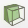
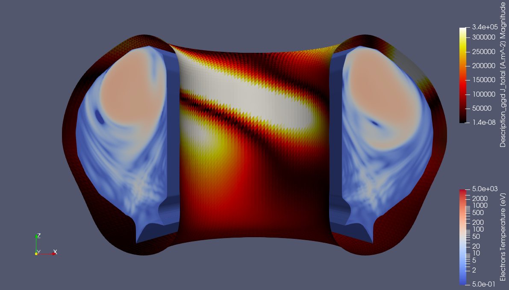
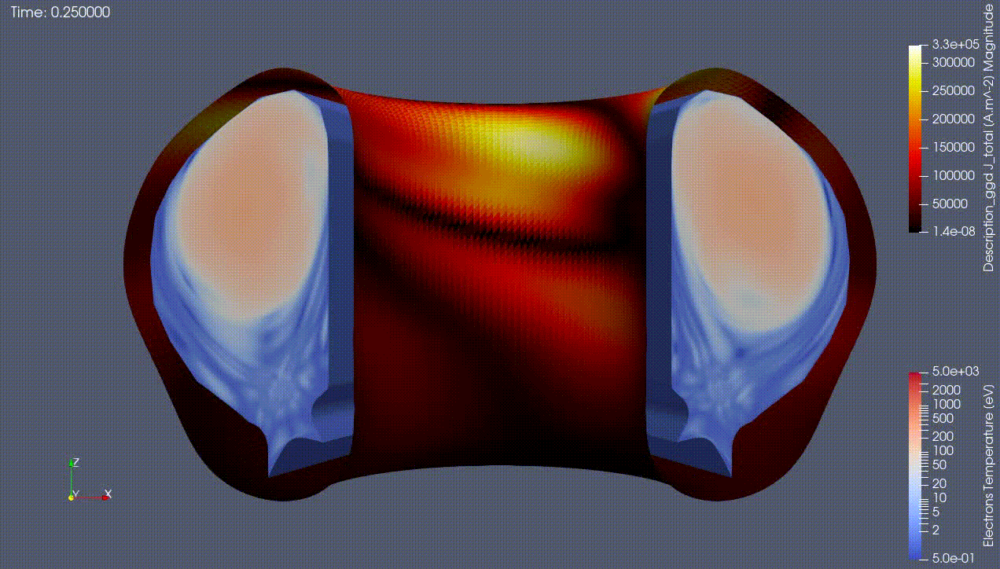

.. _`training_jorek`:

JOREK Case
----------
In this example, we visualize a JOREK disruption case available from the `confluence page <https://confluence.iter.org/display/IMP/The+JOREK+disruption+cases>`_. We will visualize the electron temperature from the ``plasma_profiles`` IDS and the corresponding current magnitude in the surrounding wall from the ``wall`` IDS. We will create an animation to visualize how these change over time.

The following URI will be used:

.. code-block:: bash

   imas:hdf5?user=public;pulse=112111;run=2;database=ITER_DISRUPTIONS;version=4

.. |ico1| image:: images/rotate_axis.png

The ParaView state file is available :download:`here <pv_states/jorek_state.pvsm>`.

Loading the Electron Temperature
^^^^^^^^^^^^^^^^^^^^^^^^^^^^^^^^
In this subsection, we load the JOREK grid and visualize the electron temperatures on this grid.

#. Navigate to *Sources > IMAS Tools* and select the JOREK Reader.
#. Enter the URI shown above in the ``Enter URI`` field of the JOREK reader plugin.
#. Select the ``plasma_profiles/1`` IDS in the IDS/Occurrence dropdown menu.
#. Select ``Apply`` to load the plasma profiles GGD grid.
#. After the GGD grid is loaded, bring the grid into view by aligning the viewpoint in the positive Y direction using the following button: |ico1|.
#. Select the ``Electrons Temperature`` from the attribute array selection window.
#. Select ``Apply`` to load the electron temperature values on the grid.
#. Select ``Electrons Temperature [eV]`` in the coloring dropdown to visualize the electron temperature.
#. Enable log scale coloring by editing the color map and selecting ``Use Log Scale When Mapping Data To Colors``.
#. Set the ``N plane`` to 3 and the ``Phi range`` from 0 to 180 degrees in the Bezier interpolation settings.

   JOREK GGD showing the electron temperature. Data provided by J. Artola.

Loading the Wall Current
^^^^^^^^^^^^^^^^^^^^^^^^
In this subsection, we load the wall currents of the simulation using the GGD Reader and apply a clip mask.

#. Navigate to *Sources > IMAS Tools* and select the GGD Reader.
#. Enter the URI shown above in the ``Enter URI`` field of the reader plugin.
#. Select the ``wall`` IDS in the IDS/Occurrence dropdown menu.
#. Select ``Apply`` to load the wall grid.
#. Select ``J_total`` from the attribute array selection window.
#. Select ``Apply`` to load the current on the wall GGD grid.
#. Select ``Description_ggd J_total [A.m^-2]`` in the coloring dropdown and select ``Magnitude`` to visualize the total wall current.
#. As the wall shows an enclosed surface that is hard to see, apply a clip filter to the wall grid. To do this, select the clip filter: |ico2|.
#. Set the normal vector to ``0, -1, 0`` and select ``Apply`` to apply the filter.
#. To distinguish between the wall currents and the electron temperature grid, change the wall current color map. Edit the color map, select ``Select a color map from default presets``, and choose a different color map.

   JOREK GGD showing the electron temperature surrounded by the wall showing the total current. Data provided by J. Artola.

Temporal Interpolation and Animation
^^^^^^^^^^^^^^^^^^^^^^^^^^^^^^^^^^^^
In this subsection, we create an animation of the loaded electron temperature and wall currents. We interpolate the time basis of both plugins to a linearly spaced basis.

#. To visualize the current time in the video, add a time value in the corner of the viewer using *Sources > Annotation > Annotate Time*. Press ``Apply`` to apply the time annotation source.
#. Select the JOREKReader and apply a ``Temporal Interpolator`` filter found under *Filters > Temporal > Temporal Interpolator*.
#. Set the ``Discrete Time Step Interval`` to 0.01, and select ``Apply`` to apply the temporal interpolation.
#. Repeat the previous two steps for the GGDReader containing the wall currents.
#. The clip must be applied to the Temporal Interpolator filter instead. Right-click the clip filter, select ``Copy Pipeline``, select the temporal interpolator, and select ``Paste Pipeline``. Ensure the wall currents are selected again in the coloring section. The old clip filter can now be removed.
#. Verify that both temporal interpolators are working by opening *View > Time Manager* and checking if the two temporal interpolators have the same number of time steps and that the time steps are of equal size.
#. Create an animation of the JOREK electron temperature and wall currents over time. Place the objects in the viewpoints in the desired orientation for the video. To create a video, go to *File > Save Animation*, provide a directory and a name for the video, and select ``OK``.
#. In the pop-up window, video settings such as image resolution and compression can be changed. In this example, only change the frame rate to 10. Press ``OK`` to start generating the animation. This may take a while.

The resulting animation is shown below:

   Animation of the electron temperature and wall currents. Data provided by J. Artola.
