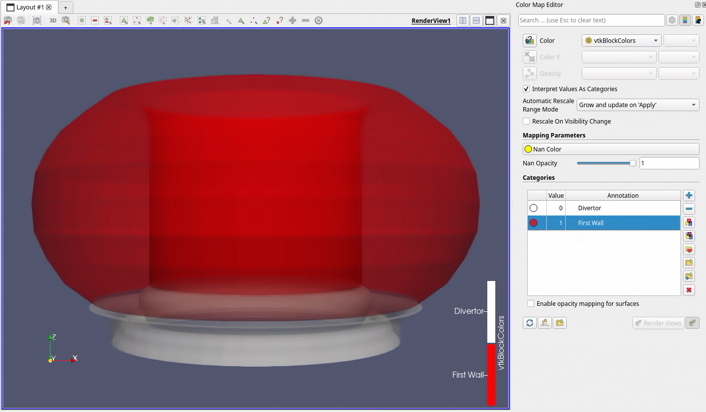
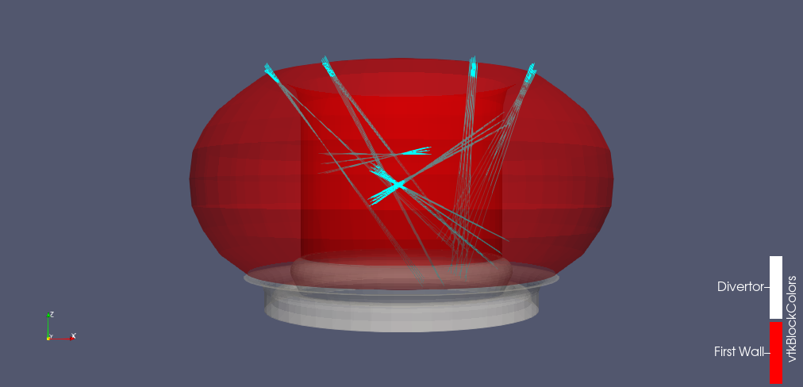
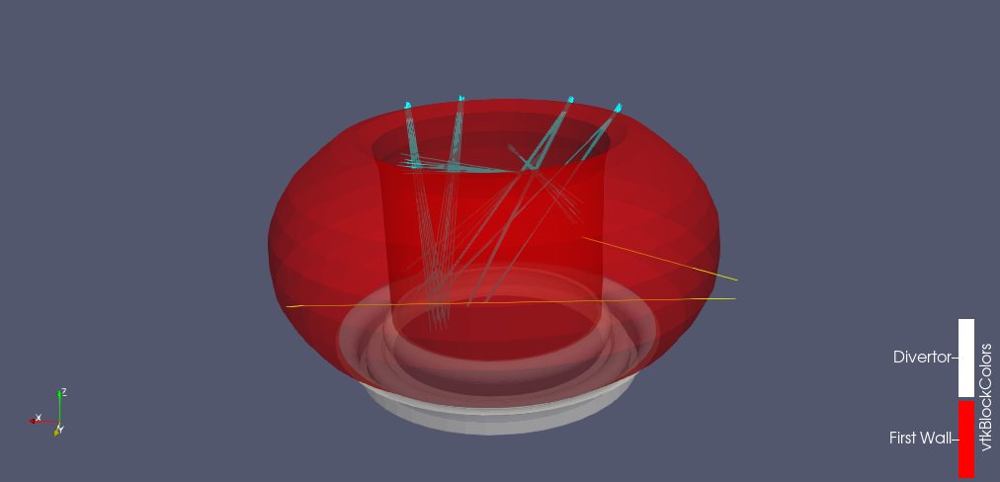
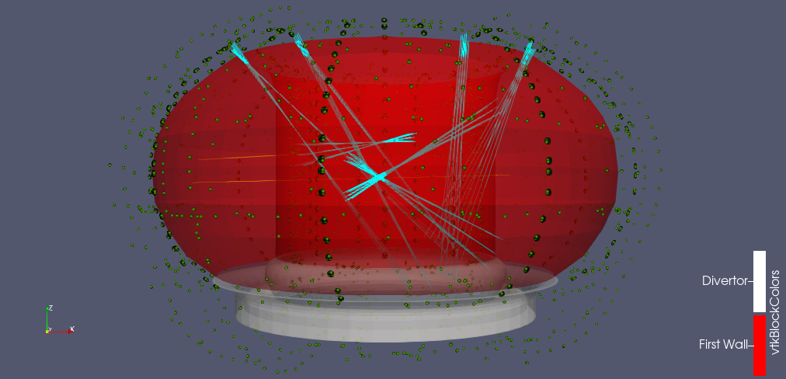

.. _`training_md`:

Machine Description case
------------------------

In this example we will combine multiple IMAS-ParaView non-GGD plugins to read ITER machine descriptiondata, and create an animation where we orbit the camera around the tokamak, so we can see the different machine description datasets clearly. 

The ParaView state file is available :download:`here <pv_states/md_state.pvsm>`.

Loading the Wall data
^^^^^^^^^^^^^^^^^^^^^
In this subsection we will visualize the divertor and first wall structures, and rotate them around their center axis.

.. |ico1| image:: images/rotate_axis.png

#. Navigate to *Sources > IMAS Tools* and select the Wall Limiter Reader.
#. Enter the following URI in the ``Enter URI`` field of the Wall Limiter reader plugin:

   .. code-block:: bash

      imas:hdf5?path=/work/imas/shared/imasdb/ITER_MACHINE_DESCRIPTION/3/116000/5

#. Since this URI only contains a single supported IDS for this reader, the wall IDS, it is automatically selected for you. You should see the *Divertor* and *First Wall* attributes appear in the attribute array selection, select them both.
#. Select ``Apply`` to load the *Divertor* and *First Wall* structures.
#. After the structures are loaded, bring them into view by aligning the viewpoint in the positive Y direction using the following button: |ico1|.
#. We will now rotate the divertor and first wall around their center axis. For this, we will use the Rotational Extrusion filter. Select the *Filters > Search...* tab, and type ``Rotational Extrusion`` and select the filter.
#. Set the resolution to 50, and the angle to 360. Press ``Apply`` to apply the rotational extrusion filter.
#. We will now fix the legend labels for the blocks, select ``Edit`` under the coloring section, and remove all the categories for numbers higher than 1, and select the minus icon.
#. Now rename the annotations for the 0 and 1 blocks to ``Divertor`` and ``First Wall``, respectively.
#. Lastly, set the opacity to 0.5, so we can visualize the inside of the wall as well.
 

   The first wall and divertor structures extruded around the center axis. Data provided by J. Artola.

Loading the EC launcher beams
^^^^^^^^^^^^^^^^^^^^^^^^^^^^^

#. Navigate to *Sources > IMAS Tools* and select the Beam Reader.
#. Enter the following URI in the ``Enter URI`` field of the Beam reader plugin:

   .. code-block:: bash

      imas:hdf5?path=/work/imas/shared/imasdb/ITER_MACHINE_DESCRIPTION/3/120000/1304
#. Since this URI only contains a single supported IDS for this reader, the ec_launchers IDS, it is automatically selected for you. You should see the EC launcher beam names appear in the attribute array selection, select them all, and press ``Apply``.
#. Change the color of the beams to a color of choosing, by pressing ``Edit`` under the coloring options. Here we use cyan.

   The EC launcher beams are added in cyan. Data provided by J. Artola.
   
Loading the Interferometer lines of sight
^^^^^^^^^^^^^^^^^^^^^^^^^^^^^^^^^^^^^^^^^

#. Navigate to *Sources > IMAS Tools* and select the Line of Sight Reader.
#. Enter the following URI in the ``Enter URI`` field of the Line of Sight reader plugin:

   .. code-block:: bash

      imas:hdf5?path=/work/imas/shared/imasdb/ITER_MACHINE_DESCRIPTION/3/150610/2
#. Since this URI only contains a single supported IDS for this reader, the interferometer IDS, it is automatically selected for you. You should see the interferometer names appear in the attribute array selection, select them both, and press ``Apply``.
#. Change the color of the lines of sight to a color of choosing, by pressing ``Edit`` under the coloring options. Here we use yellow.

   The interferometer lines of sight are added in yellow. Data provided by J. Artola.

Loading the Magnetics Coil Positions
^^^^^^^^^^^^^^^^^^^^^^^^^^^^^^^^^^^^

#. Navigate to *Sources > IMAS Tools* and select the Position Reader.
#. Enter the following URI in the ``Enter URI`` field of the Position reader plugin:

   .. code-block:: bash

      imas:hdf5?path=/work/imas/shared/imasdb/ITER_MACHINE_DESCRIPTION/3/150100/5
#. Since this URI only contains a single supported IDS for this reader, the magnetics IDS, it is automatically selected for you. You should see the magnetic coil names appear in the attribute array selection, select them all, and press ``Apply``.
#. To visualize the positions, select the ``Point Gaussian`` representation under the Display properties section, and increase the Gaussian Radius to 0.05.
#. Change the color of the coil positions to a color of choosing, by pressing ``Edit`` under the coloring options. Here we use green.

   The magnetic coil positions are added in green. Data provided by J. Artola.

Create an Animation with Orbiting Camera
^^^^^^^^^^^^^^^^^^^^^^^^^^^^^^^^^^^^^^^^

#. Open the Time Manager under *View > Time Manager*
#. At the bottom besides the *Animations* tab, select *Camera* and *Follow Path*. Then press the plus-icon to create a new camera animation.
#. Double-click the ``Camera - RenderView1`` camera animation that you created. Select the first time value and select ``Create Orbit``. Here, ensure the normal vector is set to 0,0,1.
#. Increase the number of frames to 100 in the Time Manager.
#. Save the animation by going to *File > Save Animation*, enter a directory and name for the video, and in the *Save Animation Options* increase the frame rate to 20.

The resulting animation is shown below:

.. figure:: images/training/machine_description.gif

   Animation of the multiple different types of ITER machine description data. Data provided by J. Artola.
