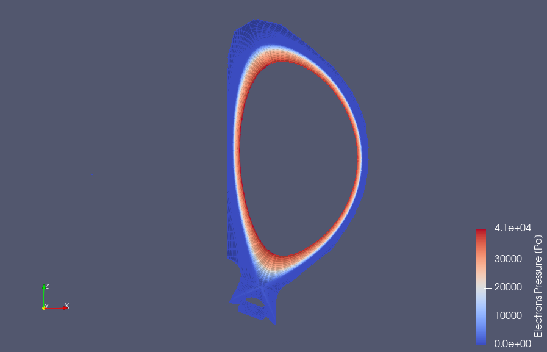
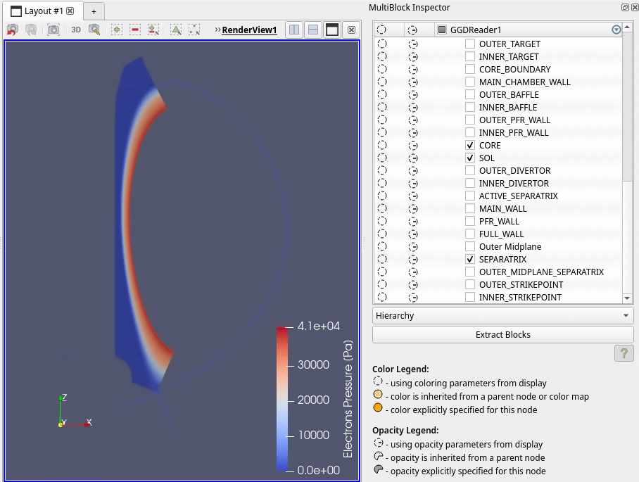

.. _`training_solps`:

SOLPS-ITER Case
---------------

In this example, we load and visualize a SOLPS-ITER case using the GGD grid available from the IMAS database. We first visualize the electron pressure from the edge_profiles IDS. Next, we extract subgrids of the GGD grid using the MultiBlock Inspector. Finally, we visualize the pressure of the Ne+9 ions and the electric potential on the extracted subgrids.

Loading the Electron Pressure
^^^^^^^^^^^^^^^^^^^^^^^^^^^^^
In this subsection, we load the SOLPS GGD grid and visualize the electron pressure on this grid.

.. |ico1| image:: images/rotate_axis.png

#. Navigate to *Sources > IMAS Tools* and select the GGD Reader.
#. Enter the following URI in the ``Enter URI`` field of the GGD reader plugin:

   .. code-block:: bash

      imas:hdf5?path=/work/imas/shared/imasdb/ITER_SCENARIOS/3/123364/1

#. Select the ``edge_profiles`` IDS in the IDS/Occurrence dropdown menu.
#. Select ``Apply`` to load the edge profiles GGD grid.
#. After the GGD grid is loaded, bring the grid into view by aligning the viewpoint in the positive Y direction using the following button: |ico1|.
#. Select the ``Electrons Pressure`` from the attribute array selection window.
#. Select ``Apply`` to load the electron pressure values on the grid.
#. Select ``Electrons Pressure [Pa]`` in the coloring dropdown to visualize the electron pressure.

   Edge Profiles GGD showing the electron pressure. Data provided by X. Bonnin.

Extracting subgrids from GGD
^^^^^^^^^^^^^^^^^^^^^^^^^^^^
In this subsection, we will extract the inner SOL, core and separatrix GGD subgrids. For more information on the GGD format and it is structured, see the `Data Dictionary documentation <https://imas-data-dictionary.readthedocs.io/en/latest/ggd_guide/doc.html>`_.

#. We can view the different types of subgrids that are stored in the GGD by using the MultiBlock Inspector. This can be found under *View > MultiBlock Inspector*.
#. The MultiBlock Inspector shows the different subgrids that are stored in this GGD object. In our case, we want to load the ``SOL``, ``CORE`` and ``SEPARATRIX`` subgrids. Select those using MultiBlock Inspector and ensure all other subgrids are deselected.
#. Click on Extract Blocks to create an Extract Block filter on the GGD reader, and select ``Apply`` to extract only the selected subgrids.

   Electron Pressure defined on the core, SOL and separatrix. Data provided by X. Bonnin.

Visualizing other attributes
^^^^^^^^^^^^^^^^^^^^^^^^^^^^
In this subsection we will visualize the GGD values for other quantities, namely the pressure of the Ne+9, and the electric potential.

#. First, we will visualize the pressure of the Ne+9 ions on the GGD grid. The attribute names follow the path names given by the Data Dictionary. For example, the `Ne+9 pressure <https://imas-data-dictionary.readthedocs.io/en/latest/generated/ids/edge_profiles.html#edge_profiles-ggd-ion-state-pressure>`_ is stored in the Data Dictionary under the path ``ggd(itime)/ion(i1)/state(i2)/pressure(i3)``, as a result to load these we need to select the ``Ion State Pressure`` in the Select attribute arrays selection. 
#. Click on ``Apply`` to load the ion pressures arrays.
#. Select ``Ion (Ne) State (Ne+9) Pressure [Pa]`` in the coloring dropdown to visualize the pressure of the Ne+9 ions.
#. Enable log scale coloring by editing the color map and selecting ``Use Log Scale When Mapping Data To Colors``.
#. Next we will load the electric potential, Phi. Select ``Phi_potential`` in the attribute array selection. 
#. Click on ``Apply`` to load the electric potential.
#. Select ``Phi_potential [V]`` in the coloring dropdown to visualize the electric potential.

.. list-table::
   :widths: 50 49
   :header-rows: 0

   * - .. figure:: images/training/solps_ne9.png
         :height: 600px
     - .. figure:: images/training/solps_phi.png
         :height: 600px
   * - Grid showing the pressure of the Ne+9 ion. Data provided by X. Bonnin.
     - Grid showing the electric potential. Data provided by X. Bonnin.

