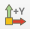

.. _`training_solps`:

SOLPS-ITER Case
---------------

In this example, we will load and visualize a SOLPS-ITER GGD grid and several quantities defined on this GGD grid. We first visualize the electron pressure from the ``edge_profiles`` IDS. Next, we learn how to extract grid subsets of the GGD grid using the MultiBlock Inspector. Finally, we will visualize the density of the Ne and the D ion side-by-side, and visualize the ratio of the two using ParaView's calculator functionality.

It is recommended to go through the steps below by hand, however if you do not want to follow the steps, a ParaView state file containing this example is made available :download:`here <pv_states/solps_state.pvsm>`.

Loading the Electron Pressure
^^^^^^^^^^^^^^^^^^^^^^^^^^^^^
In this subsection, we will load the SOLPS GGD grid and visualize the electron pressure on this grid.

#. Navigate to *Sources > IMAS Tools* and select the GGD Reader.
#. Enter the following URI in the ``Enter URI`` field of the GGD reader plugin:

   .. code-block:: bash

      imas:hdf5?path=/work/imas/shared/imasdb/ITER_SCENARIOS/3/123364/1

#. Select the ``edge_profiles`` IDS in the IDS/Occurrence dropdown menu.
#. Select ``Apply`` to load the edge profiles GGD grid.
#. After the GGD grid is loaded, bring the grid into view by aligning the viewpoint in the positive Y direction using the following button: |ico1|.
#. Select the ``Electrons Pressure`` from the attribute array selection window.
#. Select ``Apply`` to load the electron pressure values on the grid.
#. Select ``Electrons Pressure [Pa]`` in the coloring dropdown to visualize the electron pressure.

   Edge Profiles GGD showing the electron pressure. Data provided by X. Bonnin.

Extracting grid subsets from GGD
^^^^^^^^^^^^^^^^^^^^^^^^^^^^^^^^
In this subsection, we will learn how to extract grid subsets from a GGD grid. Specifically, we will extract the inner SOL, core and separatrix GGD grid subsets. For more information on the GGD format and how it is structured, see the `Data Dictionary documentation <https://imas-data-dictionary.readthedocs.io/en/latest/ggd_guide/doc.html>`_.

#. We can view the different types of grid subsets that are stored in the GGD by using the MultiBlock Inspector. This can be found under *View > MultiBlock Inspector*.
#. The MultiBlock Inspector shows the different grid subsets that are stored in this GGD object. In our case, we want to load the ``SOL``, ``CORE`` and ``SEPARATRIX`` grid subsets. Select those using MultiBlock Inspector and ensure all other grid subsets are deselected. You should now see the electron pressure for only the selected grid subsets.

.. figure:: images/training/solps_multiblock.png

   Electron Pressure defined on the core, SOL and separatrix. Data provided by X. Bonnin.

Visualizing Ion Density
^^^^^^^^^^^^^^^^^^^^^^^
This subsection demonstrates how to visualize the density of Deuterium (D) and Neon (Ne) ions across the complete GGD grid, as well as compute and visualize their density ratio.

#. Start by selecting all the grid subsets again in the MultiBlock Inspector and then close the MultiBlock Inspector. You should now see the full GGD grid again.
#. We will visualize the pressure density of the Ne and D ions on the GGD grid. Select the ``Ion Density`` in the Select attribute array selection.
#. Click on ``Apply`` to load the ion pressures.
#. You should now see both ``Ion (D) Density [m^-3]`` and ``Ion (Ne) Density [m^-3]`` options in the coloring dropdown. We want to visualize them side by side. To do so, open a new RenderView by pressing the following button: |ico2|.
#. In the *Create View* section select the ``Render View`` button to create a new RenderView, and ensure you enable view of the GGD reader by selecting the eye icon.
#. Select the left render view, and select the D density in the coloring section. Similarly, select the right render view and select the Ne density int the coloring section.
#. We will now create another render view, in which we will show the ratio of the Ne / D ion density. First, create a new RenderView like before, select the GGD reader and apply the calculator tool, under **Filters >  Data Analysis > Calculator**.
#. In the calculator properties, change the **Attribute Type** to Cell Data, set the result array name to ``Ne / D Density``. Next, under the **Scalars** dropdown, select the ``Ion (Ne) Density [m^-3]``, then the division symbol, followed by ``ion (D) Density [m^-3]``. The calculator input should now show: ``"Ion (Ne) Density [m^-3]"/"Ion (D) Density [m^-3]"``.
#. Select the ``Apply`` button, and select the ``Ne / D Density`` in the coloring dropdown menu.

   Grid showing the Deuterium density (left), the Neon density (middle), and the ratio of Deuterium over Neon density (right). Data provided by X. Bonnin.
