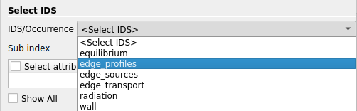

.. _`usage`:

Using GGD-VTK
=============
This page will go over how to use the Paraview plugins, as well as the CLI interface.

Visualize GGD in Paraview
-------------------------
If Paraview is correctly installed according to the :ref:`installation docs <installing>`, you should
see the GGD reader plugin under `Sources > VTKGGD Tools > IMASPyGGDReader`. Selecting this source
will create an IMASPyGGDReader source in the Paraview pipeline.

The first step is to select which URI you want to load. The IMASPyGGDReader provides three different
methods of supplying an URI.

1. A string containing the URI.
2. A file browser with which you can select the file to load
3. Manual selection of the backend, database, pulse, run, user, and version

These are shown in the figure below:

.. list-table::
   :widths: 33 33 33
   :header-rows: 0

   * - .. figure:: images/input_uri.png

         1\. String input.
     - .. figure:: images/input_file.png

         2\. File browser.
     - .. figure:: images/input_legacy.png

         3\. Manual input.

.. tip:: More information about the usage of specific plugin UI elements can be obtained by hovering
   the mouse over the element.

When the URI is loaded, an IDS can be selected from the drop-down list. The reader automatically
detects which IDS is available for the given URI, and only shows applicable IDSs for this plugin.

   The drop-down list to select an IDS.

.. |ico1| image:: images/rotate_axis.png

After the IDS is loaded, the grid should appear in the viewport. If the grid does not show up, it is
possible that the axes are not aligned properly. You can use the buttons above to align your viewpoint
with the data. For example, to align the viewpoint in the positive Y direction, press: |ico1|.

The selection window shows a list of physical quantities which are defined on the grid which is
currently displayed. Any of these (or all) can be selected in the selection box, additionally these
entries can be filtered using the |ico2|-icon in the top right of the selection box. The selected
quantities can now be selected using Paraview's selection drop-down menu.

.. note:: By default, the data is lazy loaded. This means that the data will only be fetched from
   the backend as soon it is required by the plugin. This helps loading times, as we don't need to
   fetch the entire dataset before handling any data. If you plan on loading the entire dataset, it
   may be benificial to disable lazy loading. This can be done by enabling the `Preload Data`
   checkbox in the plugin settings.

Convert GGD to VTK using the CLI
--------------------------------
GGD-VTK supports converting the GGD of an IDS to VTK format from a command-line interface (CLI).
This can be by using the `ggd2vtk` tool. Detailed usage, as well as examples can be found by running

  .. code-block:: bash

    vtkggdtools ggd2vtk --help

Example usage:

  .. code-block:: bash

    vtkggdtools ggd2vtk imas:hdf5?path=testdb#edge_profiles output_dir

