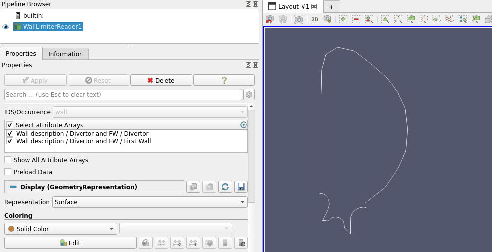

.. _`using the Wall Limiter Reader`:

Wall Limiter Reader
===================

This page explains how to use the Wall Limiter Reader to visualize limiter structures of 
description 2D structures in a Wall IDS.

Supported IDSs
--------------

Currently, the following IDS is supported in the 1D Profiles Reader.

- ``wall``

Using the Wall Limiter Reader
-----------------------------

The Wall Limiter Reader functions similarly to the GGD Reader, with the same interface and data loading workflow. 
This means that the steps for loading an URI, an IDS, and selecting attributes are identical. 
Refer to the :ref:`using the GGD Reader` for detailed instructions on:

- :ref:`Loading an URI <loading-an-uri>`: How to provide the file path or select a dataset.
- :ref:`Loading an IDS <loading-an-ids>`: How to load a dataset and display the grid.
- :ref:`Selecting attribute arrays <selecting-ggd-arrays>`: How to choose and visualize attributes.

The following image shows the limiter structures of a description 2D structure of a wall IDS.

   The first wall and divertor of a wall IDS.
